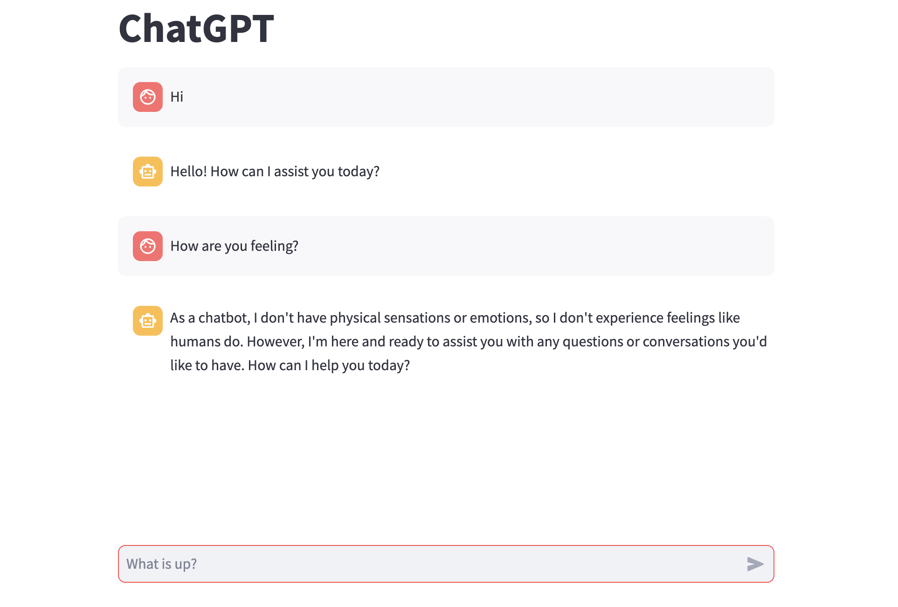
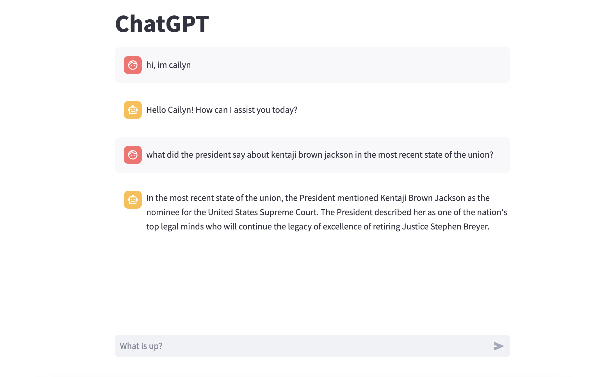

## Overview

This is a clone of ChatGPT. There are two versions, and both of them hold chat memory. <br />
Run `streamlit run chatbot.py` for just a simple casual conversation with ChatGPT. <br />
 <br />
Run `streamlit run retrieval-chatbot.py` for a LLM that can chat with documents or some other source of knowledge. <br />


---

## To run

Make sure to fill in the API keys for OpenAI.

```
python3 -m venv venv
source venv/bin/activate
pip3 install openai langchain python-dotenv tiktoken faiss-cpu streamlit chromadb bs4
streamlit run chatbot.py
```

If streamlit is not working, checkout their [installation page](https://docs.streamlit.io/library/get-started/installation)
